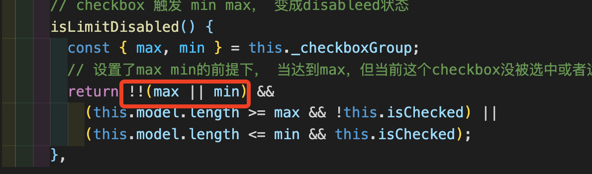

# checkbox

## 前言

checkbox一系列组件和radio组件大同小异，对于相同的地方就不会再详细记录，重点描述其不同点

---
## 页面结构（html）

```
<label>
    <span 1>
        <span 2></span>
        <input v-if 1>
        <input v-else 2>
    </span>
    <span 3></span>
</label>
```
* 与raido基本一致，不同点在与input的隐藏方式：opacity+zindex+宽高设为0+position absolute
* checkbox单独使用时，用一个基本类型的值保存结果就好了，但如果多个checkbox使用，那么结果就必须用数组保存，因此这里需要两个input
* 选中效果的对勾没有用icon,而是通过css实现的
    * [参考](https://juejin.im/post/6844903662678966286#heading-1)
---
## 布局设计（css)

---
## 逻辑设计（js）
1. __[element && vue 组件设计]__ input的设计中有“:true-value='truelabel' :false-value='falselabel'", 此处涉及到vue源码中v-model的实现
---
## 使用规范
```
// 只有1个checkbox时,有两种方式使用

// 1: 只用v-model, 但v-model的值必须是boolean类型
<el-checkbox v-model='checked'></el-checkbox> 

// 2: v-model + true-label/false-label
<el-checkbox v-model='m' true-label='a' false-label='b'>
</el-checkbox>

// checkbox >= 2 时，两种使用方式
// 备注：label属性只能用于 checkbox-group 或v-model的值为array时（也就是只能在 3、4里用）

// 3 使用checkbox-group
<el-checkbox-group v-model='v'>
    <el-checkbox label='a'></el-checkbox>
    <el-checkbox label='b'></el-checkbox>
    <el-checkbox label='c'></el-checkbox>
</el-checkbox-group>

// 4 不使用checkboxgroup, 只使用值为array的v-model
<el-checkbox v-model='gg' label='a'></el-checkbox>
<el-checkbox v-model='gg' label='b'></el-checkbox>
```
## 注意事项
* label属性只能用于 checkbox-group 或v-model的值为array时（也就是只能上面的 3、4里用）
---

## 源码注释
* [checkbox](../../packages/checkbox/src/checkbox.vue)
---
## 问题
Q: 写法问题（为什么要用双感叹号)

A: 将结果转化为boolean类型


---
## todo
* [vue] v-model的实现
---
## refer
---
## checkbox-button、checkbox-group
1. checkbox-button与checkbox的区别主要在于样式变化，代码设计基本一致，此处不再赘述
2. checkbox-group与checkbox之间的设计和radio-group与radio之间的设计是一样的，这里同样不再赘述

## checkbox组件设计总结(和radio一样)
1. 主要依赖v-model完成整体功能
2. 涉及到v-model 、provide/inject等vue api的使用
3. 隐藏input, 使用span完成单选按钮功能，会在样式上可控性更好