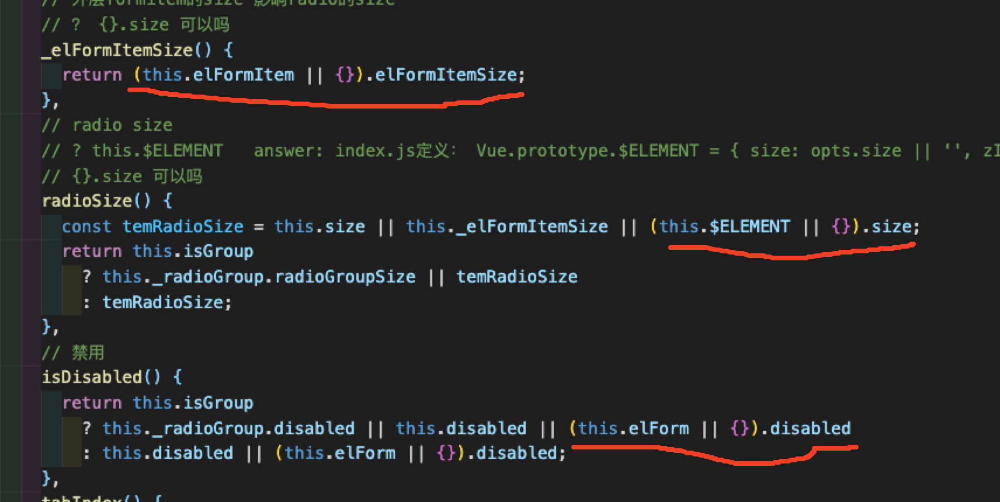

# radio

## 页面结构（html）

```
<label>
    <span 1>
        <span 2></span>
        <input>
    </span>
    <span 3></span>
</label>
```
* 视觉所看到的单选按钮其实就是span1
* input 通过position+ z-index+opacity 放到span2的下方
* span3即按钮的文字部分
---
## 布局设计（css)
__[knowledge css]__ css position: absolute 中优先级left>right，top>bottom，在position：absolute的元素小于position：relative元素的情况下，以下代码
的实际效果相当于

---
## 逻辑设计（js）
1. __[elementui  src/mixins/emitter.js]__  共dispatch和broadcast两个函数
    * 作用： 触发emit事件
    * dispatch 找到的第一个名为componentName的祖辈组件emit
    * broadcast 让其特定的子孙组件emit
2. __[vue api minxins]__
    * 作用：复用vue组件中的功能
    * 值可以包含任意的组件选项
    * 在组件自身钩子执行之前调用
    * 值发生冲突时，优先取组件自身的值
    * 同名的钩子函数都会被调用
    * 也可全局注册Vue.mixin() （谨慎使用,会为每一个vue实例注册）
3. __[vue api inject、provide]__
    * 用于祖孙组件传值
    * vue不会对provide的值进行响应式处理，要想inject的值是响应式的，provide传的值就必须是响应式的
    * 使用规范：只用做查看上级组件的值，不能用于修改（若想修改可直接使用vuex  props等方法）任意地方可随意修改值，导致数据变化不可控
    * 使用场景： 编写组件/插件（参考文章里的例子很好, 关于form 传值给formitem radio, 我理解为当需要传值，但父子组件的关系不太确定时使用）
    * [refer](https://juejin.im/post/6844903989935341581)
4. __[vue ~~api~~ componentName ]__  componentName
    * 没有这个api(第一次看到我还以为有这个api)， 这应该属于vue的自定义属性，可通过this.$options.componentName访问
    * 使用场景：暂时归纳不出来，本例是为了唯一标识每个组件
5. __[vue 语法]__ $slots.default 指的默认插槽
6. __[vue knowledge]__ `v-model='a'`, a 不仅可以是data， 还可以是coumputed（计算属性）
7. __[vue 语法]__ `<component-a disabled></component-a>`是`<component-a disabled=‘true'></component-a>`的缩写，仅支持boolean且值为true的类型
---
## 使用规范

## 注意事项
* el-radio 与el-radio-button的使用区别： el-radio-button 必须在el-button-group中
* radio-button是不会暴露change事件的，换句话说，使用radio-button时，外层的radio-group是监听不到change事件的
---

## 源码注释
* [radio](../../packages/radio/index.js)
* [emitter.js](../../src/mixins/emitter.js)
## 问题
Q: {}.size {}.disabled这种写法可以吗

A: {}.size 只会报语法错误，如果elFormItem 不存在的话，this.elFormItem.size会直接程序出错。


Q 如果radio 、radio-button都在change时$emit('change'), 那么radio-group是都可以监听到的，但为啥radio-button 会设计成先触发handleChange,然后再触发change（而由于监听handleCahgne被设计到了radio-group的created中，导致实际上对于radio-button的change， radio-group是监听不到）

A: 我忽略了$on $emit 是订阅事件，虽然是在created中执行，但只要radio-button 触发$emit，那么就可以通过$on监听到这个事件。同时也要学习这种设计方法，对于注定在外层又一个父元素的情况，内层元素往外触发事件时，只需要在父元素的created中$on监听就好了。


## todo
* [vue] v-model的实现
* [vue] $vnode的内容
## refer
---
## radio组件设计总结
1. 主要依赖v-model完成整体功能
2. 涉及到v-model 、provide/inject等vue api的使用
3. 隐藏input, 使用span完成单选按钮功能，会在样式上可控性更好